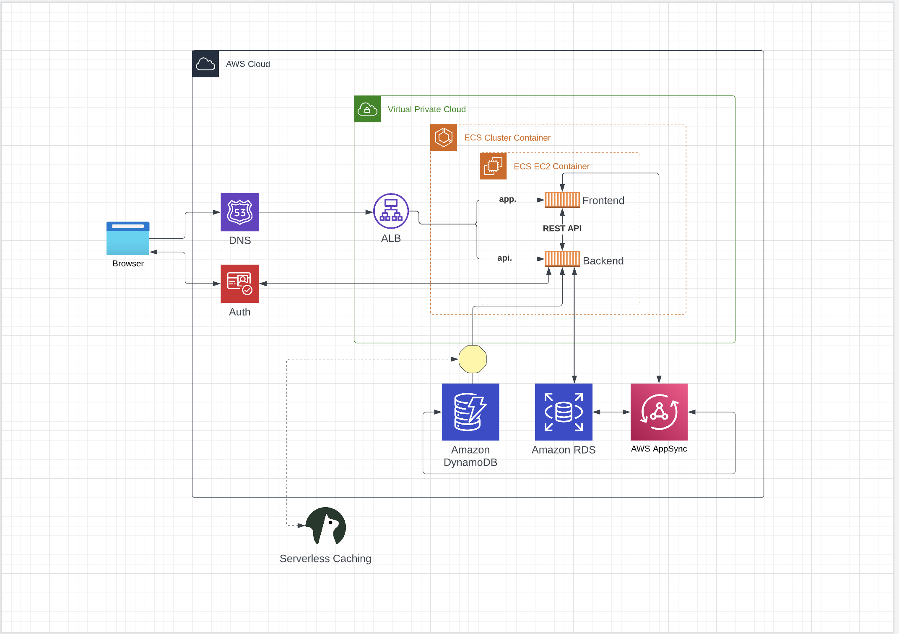
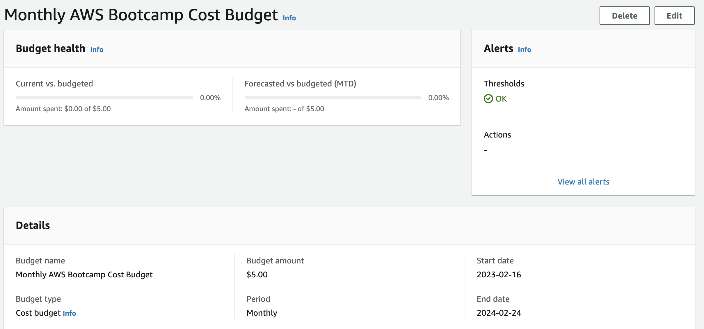
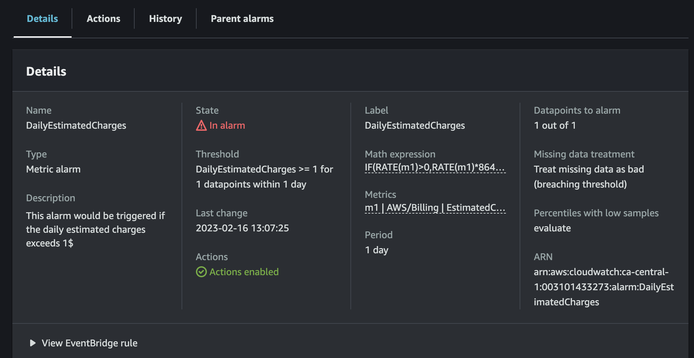

# Week 0 — Billing and Architecture

## Required

- Recreated architectural diagram in [Lucidchart](https://lucid.app/lucidchart/b3b6b4af-a646-4bd8-9e20-65f8fa03b17d/edit?viewport_loc=-301%2C-105%2C2285%2C1650%2C0_0&invitationId=inv_12cca015-f027-4af6-8ff7-2acf6ebbe967)



- Created Monthly Cost Budget  
   [budget file](../aws/json/budget.json)  
   [budget notification file](../aws/json/budget-notifications-with-subscribers.json)

  ```
  aws budgets create-budget  \
    --account-id $AWS_ACCOUNT_ID  \
    --budget file://aws/json/budget.json  \
    --notifications-with-subscribers file://aws/json/budget-notifications-with-subscribers.json
  ```

  

- Created Daily Limit Alarm  
   [alarm file](../aws/json/alarm-config.json)

  
