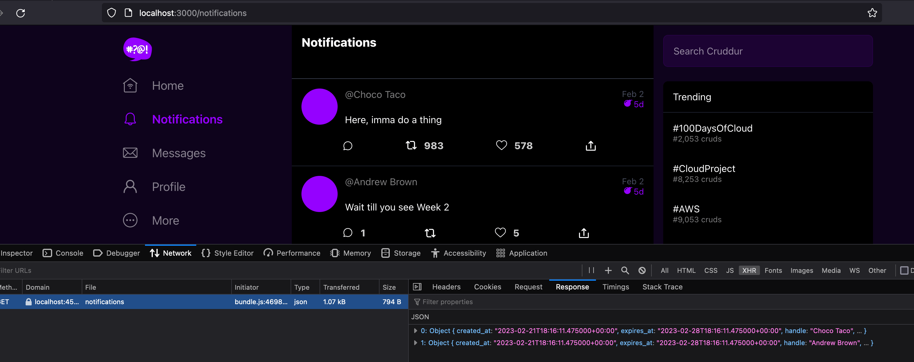

# Week 1 — App Containerization

## Required Tasks

1. Backend

   - Install deps, set env vars and run locally

     `pip3 install -r ./backend-flask/requirements.txt`

     `export BACKEND_URL="*" && export FRONTEND_URL="*"`

     `cd ./backend-flask && python3 -m flask run --host=0.0.0.0 --port=4567`

   - Built and run backend docker image  
     `docker build -t backend-flask ./backend-flask`

     `docker run --rm -d -p 4567:4567 -e BACKEND*URL='*' -e FRONTEND*URL='*' backend-flask`

     

2. Frontend

   - Install deps, set env vars and run frontend locally

     `cd frontend-react-js && npm i`

     `export REACT_APP_BACKEND_URL="localhost:4567" && npm start`

   - Built and run frontend docker image  
     `docker build -t frontend-react-js ./frontend-react-js`

     `docker run --rm -d -p 3000:3000 -e REACT_APP_BACKEND_URL=“localhost:4567” frontend-react-js`

     

3. Docker compose

   `docker compose up`

   

4. Notification feature

   - Added an enpoint for notifications on backend
   - Added a page for notifications on frontend
   - Added enpoint details to OpenApi spec file

   

5. Dynamo DB

   - Added dynamodb service to [docker-compose.yml](/docker-compose.yml)
   - Created and populated Music table with aws CLI

   

6. Postgres

   - Added pg service to [docker-compose.yml](/docker-compose.yml)
   - Created crudder db

   

## Challenges

- Push images to Docker hub

  `docker tag aws-bootcamp-cruddur-2023-backend-flask asteroid2k/crudder-backend:0.1.0`  
  `docker push asteroid2k/crudder-backend:0.1.0`

  `docker tag aws-bootcamp-cruddur-2023-frontend-react-js asteroid2k/crudder-frontend:0.1.0`  
  `docker push asteroid2k/crudder-frontend:0.1.0`

  

- Health checks in docker compose

  Added health checks for both services using curl. Specified parameters i.e timeout, interval etc in the [docker compose file](/docker-compose.yml) for regular pinging.

- Created a multi step Dockerfile

  Seperated frontend build process into build step (install and build) and run step (copy build files and host with NGINX) on port 80. See [Dockerfile.multi](/frontend-react-js/Dockerfile.multi)  
  

- Docker on EC2

  Installed Docker on an EC2 instance (Ubuntu)  
  Pulled and run backend docker image  
  [ec2 link](http://ec2-54-158-194-222.compute-1.amazonaws.com:4567/api/activities/home)

  ```
   sudo docker pull asteroid2k/crudder-backend:0.1.1

   sudo docker run --rm -d -e FRONTEND_URL="*" -e BACKEND_URL="*" -p 0.0.0.0:4567:4567 asteroid2k/crudder-backend:0.1.1

  ```

  

  Edited inbound rules to allow traffic to :4567

  
