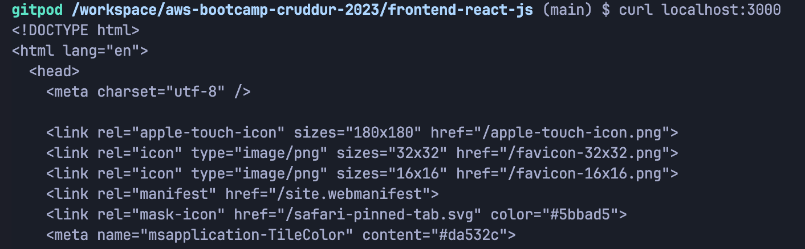

# Week 1 — App Containerization

## Required Tasks

1. Backend

   - Install deps, set env vars and run locally

     `pip3 install -r ./backend-flask/requirements.txt`

     `export BACKEND_URL="*" && export FRONTEND_URL="*"`

     `cd ./backend-flask && python3 -m flask run --host=0.0.0.0 --port=4567`

   - Built and run backend docker image  
     `docker build -t backend-flask ./backend-flask`

     `docker run --rm -d -p 4567:4567 -e BACKEND*URL='*' -e FRONTEND*URL='*' backend-flask`

     

2. Frontend

   - Install deps, set env vars and run frontend locally

     `cd frontend-react-js && npm i`

     `export REACT_APP_BACKEND_URL="localhost:4567" && npm start`

   - Built and run frontend docker image  
     `docker build -t frontend-react-js ./frontend-react-js`

     `docker run --rm -d -p 3000:3000 -e REACT_APP_BACKEND_URL=“localhost:4567” frontend-react-js`

     

3. Docker compose

   `docker compose up`

   
