# Week 2 — Distributed Tracing

## Required Tasks

1. Honeycomb integration with backend

   - Create and configure Honeycomb account
   - Export OTEL and Honeycomb env vars
   - Add env vars and service name to backend service in [docker-compose.yml](../docker-compose.yml)
   - Updated backend package [requirements](../backend-flask/requirements.txt) with open telemetry packages
   - Configure open telemetry in backend, add tracer and span to home and notification endpoints

   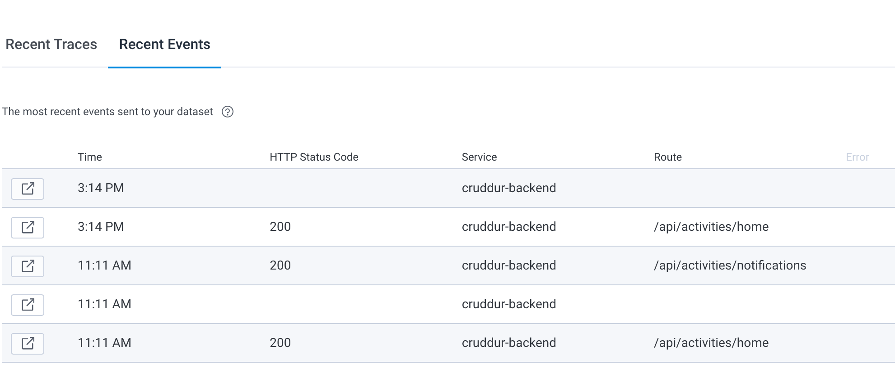

   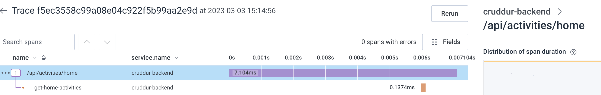

   - Add app.now and app.result_length span attributes

     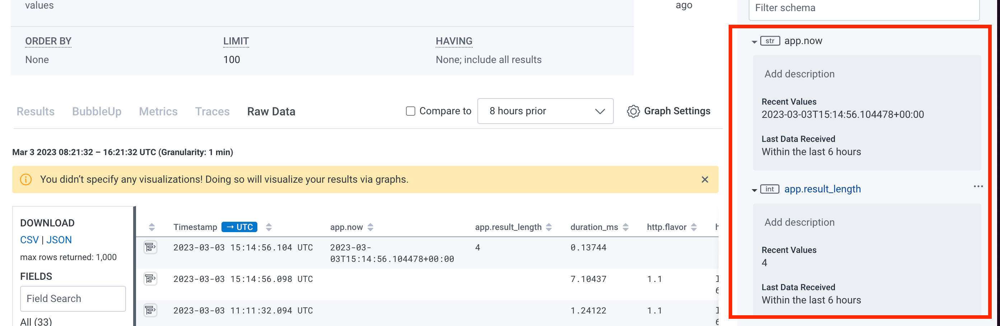

2. AWS X ray integration with backend

   - Create group and sampling rule
     ```
      --group-name "Cruddur" \
      --filter-expression "service(\"cruddur-backend\")"
     ```
   - Add env vars and x ray service in [docker-compose.yml](../docker-compose.yml)
   - Updated backend packages [requirements](../backend-flask/requirements.txt) with x ray sdk

   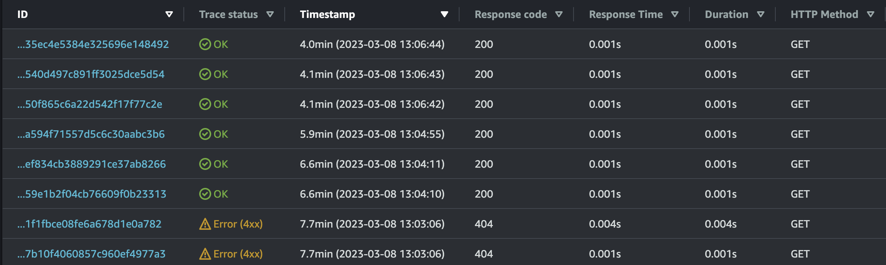

   - Add app.now and res.length metadata to notifications [service](../backend-flask/services/notification_activities.py)

     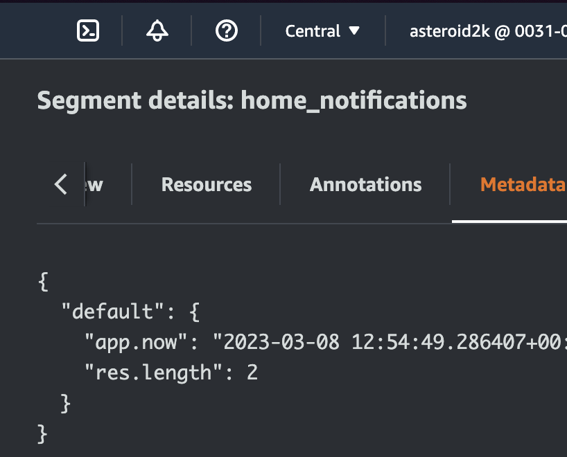

3. AWS CloudWatch logging on backend

   - Add AWS env vars to backend service in [docker-compose.yml](../docker-compose.yml)
   - Updated backend packages [requirements](../backend-flask/requirements.txt) with watchtower lib
   - Added log to /api/activities/home endpoint

   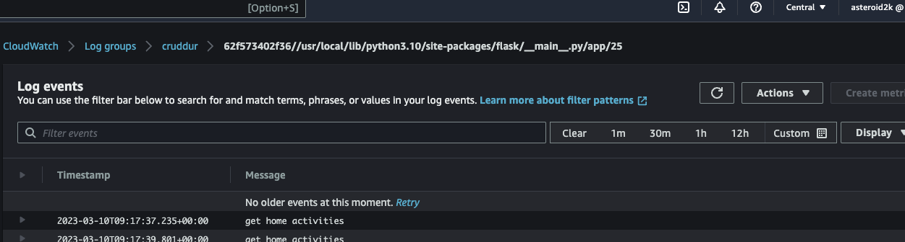

4. Rollbar integration with backend

   - Setup Rollbar project and export token in enviroment
   - Add Rollbar env vars to backend service in [docker-compose.yml](../docker-compose.yml)
   - Updated backend packages [requirements](../backend-flask/requirements.txt) with rollbar and blinker
   - Added new endpoint to test rollbar `/rollbar/test`

   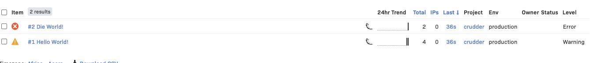

## Challenges

1. Honeycomb integration with frontend

   - Create and configure frontend api key to allow just sending of events (security recommendation)

   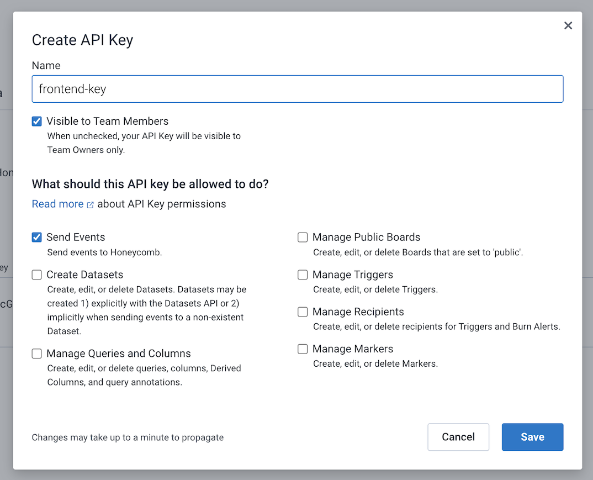

   - Export OTEL and Honeycomb env vars
   - Add env vars and service name to frontend service in [docker-compose.yml](../docker-compose.yml)
   - Updated [package.json](../frontend-react-js/package.json) with open telemetry packages
   - Configure open telemetry in frontend, add tracer and span to home endpoint

   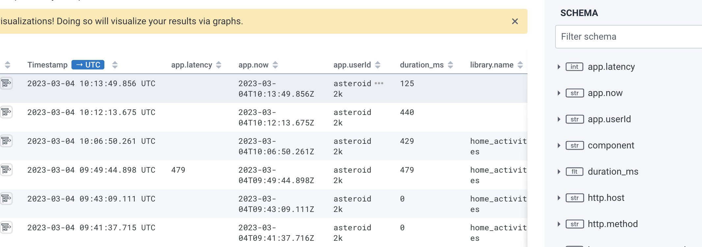

   - Added app.userId (used username) span attribute

     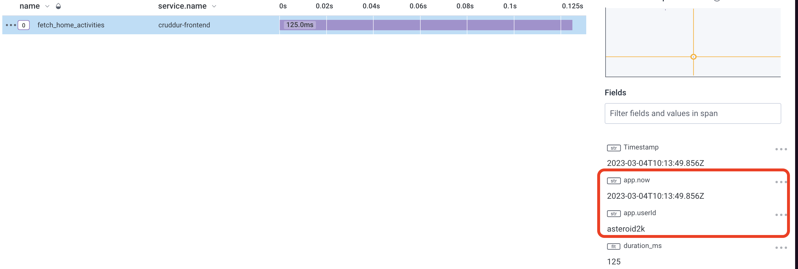

   - Created query to find average latency by userId

     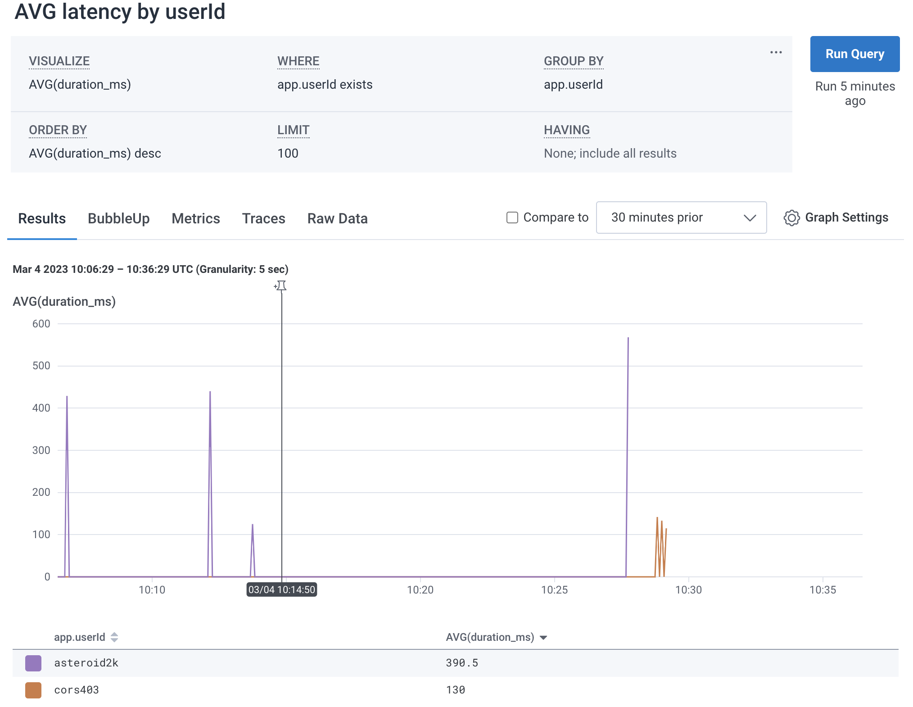
